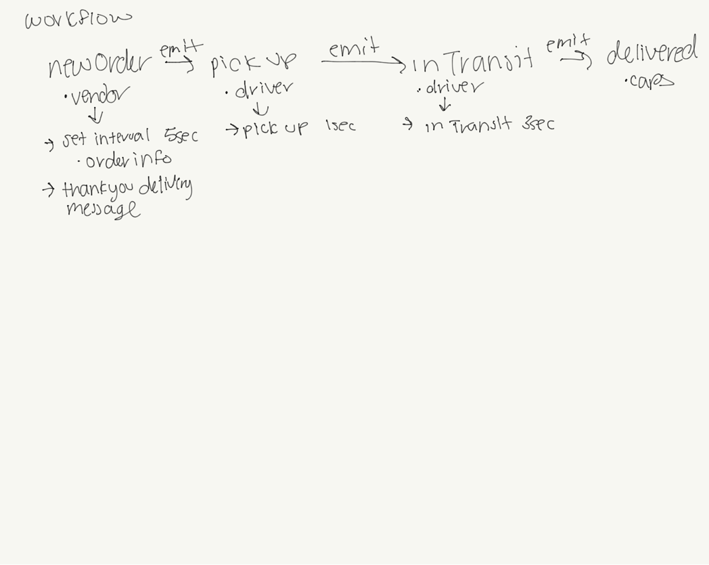

# CAPS

## Author
Simone Odegard

## Important Links
- [github actions](https://github.com/SimoneOdegard/CAPS/actions/new) - coming soon!
- [deployment](http://google.com)

## Repo Name
CAPS

## Branch Name
events

## Setup
```.env``` requirements
- ```PORT``` - Store name

Running the app
- ```npm i dotenv faker```

Tests
- ```npm run test```

## UML Diagram


## Pull Requests
[PR 1](https://github.com/SimoneOdegard/CAPS/pull/1)